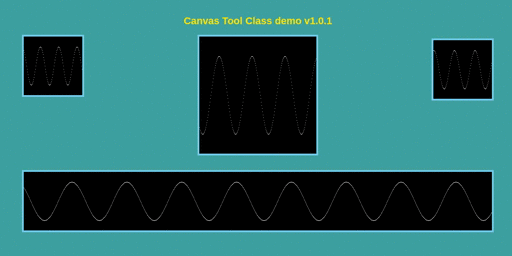

# js-sdk-canvas

CanvasToolClass - Class to manage the pixel to draw into canvas in Context.ImageData (Canvas API).

### Version 1.0.1

| Item       | Details                 | Changes |
| ---------- | ----------------------- | ------- |
|       Date | October 23, 2023        | N/A |
| Release by | Teodoro Albon           | N/A |
|    Version | 1.0.0 Initial Release   | N/A |
|    Version | 1.0.1 November 23, 2023 | set willReadFrequently: true |

<br/>

### File listing

<details><summary>v1.0.1 File listing</summary>

<br/>

| Filename               | version | Purpose                       | Description               | MIME type              |  CRC-32  |
| ---------------------- | ------- | ----------------------------- | ------------------------- | ---------------------- | -------- |
| js-sdk-canvas-1.0.1.js | v1.0.1  | JavaScript TuneURL SDK source | TuneURL SDK in JavaScript | application/javascript | d443d4c8 |
| test.js                | v1.0.1  | WebAssembly file              | WebAssembly               | application/wasm       | fe13bb2d |
| package.json           | v1.0.1  | Future update for the SDK     | Future update for the SDK | application/json       | fe033987 |
| README.md              | v1.0.1  | this file                     | Read me                   | text/plain             | N/A      |
| canvas-demo.html       | v1.0.1  | Sample Html to show how to use| show source / fingeprint  | text/html              | e88e5d1c |

<br/>

</details>

<br/>
<br/>
<br/>
<br/>

### Testing

```bash
npm install
```

### run test via npm

```bash
npm run test
```

### run test via node

```bash
node test.js`
```

```bash
# Visit http://localhost:3000/canvas-demo.html

# It should display something like the sample gif below
```

<br/>
<br/>
<br/>
<br/>




<br/>
<br/>
<br/>
<br/>

### NOTES

| Item | Version | Descriptions |
| ---- | ------- | ------------ |
| 1. | v1.0.0 | Initial version |
| 2. | v1.0.1 | set willReadFrequently to true |
